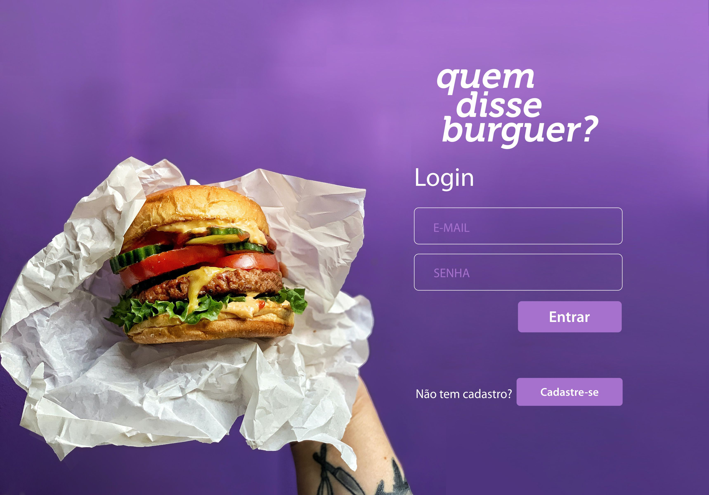
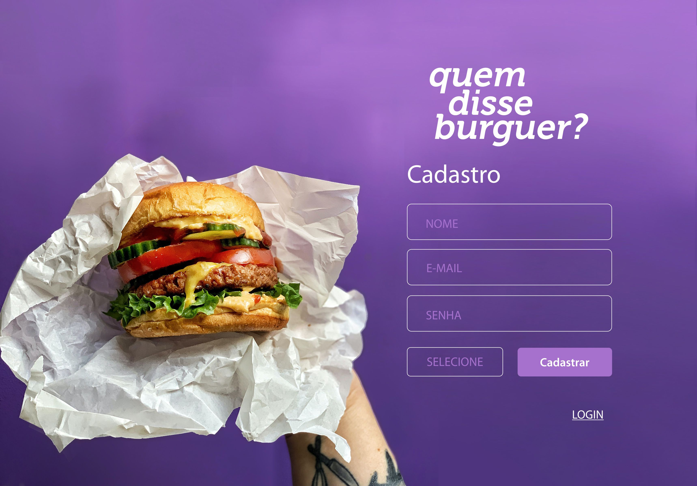
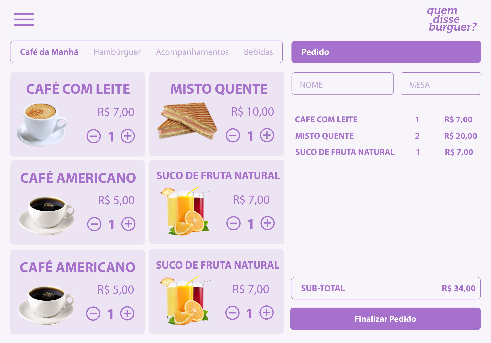
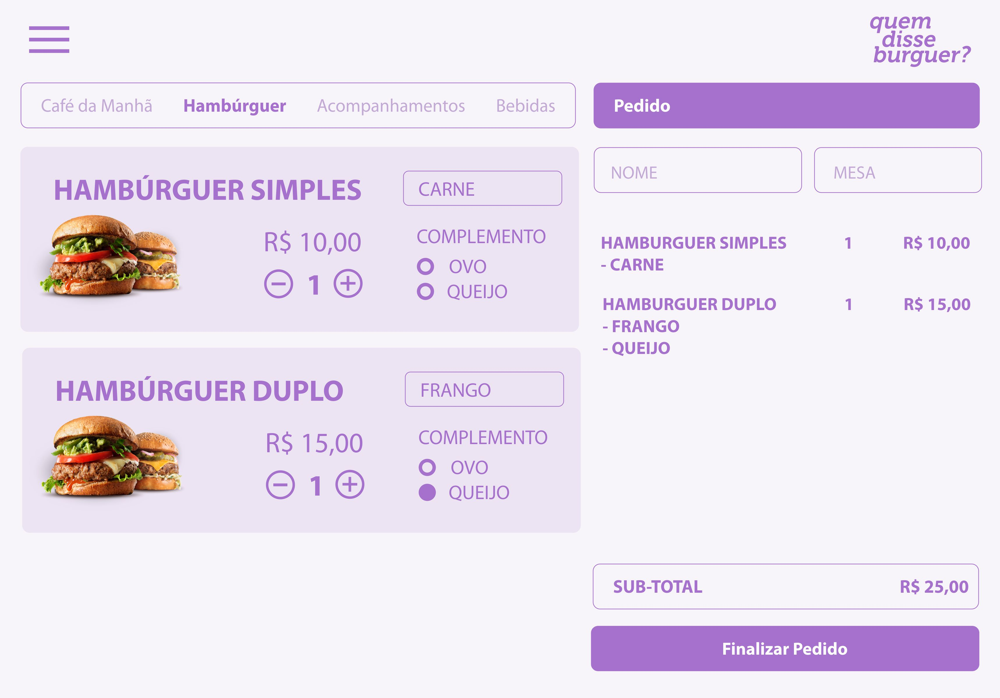
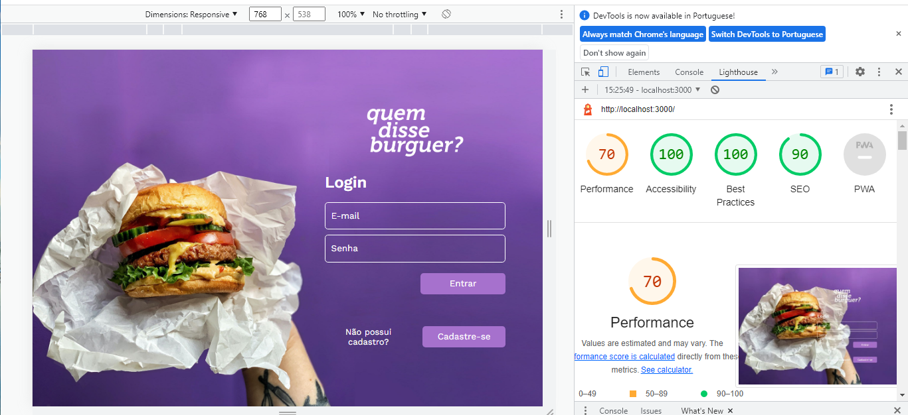
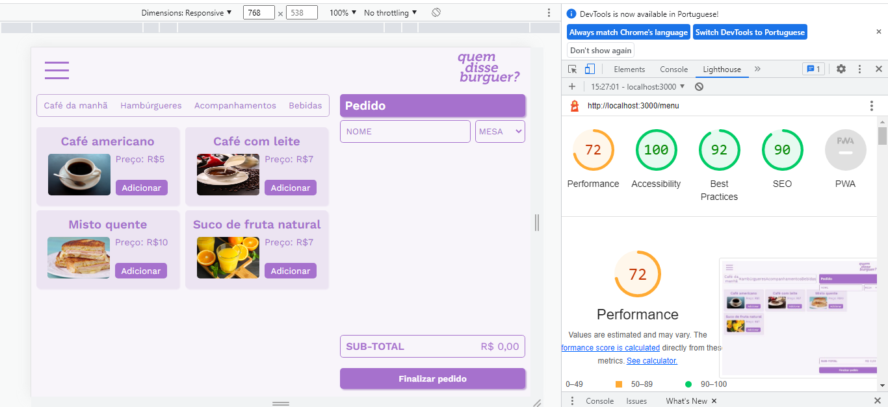
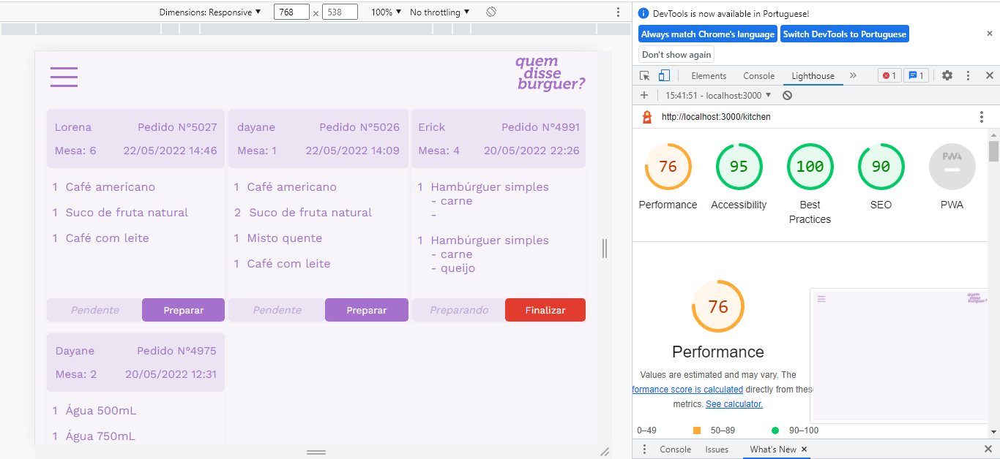

***

***

## SOBRE O PROJETO

**Quem Disse Burguer ?** é um pequeno restaurante de hambúrgueres, que está crescendo, necessita uma interface em que se possa realizar pedidos utilizando um tablet, e enviá-los para a cozinha para que sejam preparados de forma ordenada e eficiente.
Esta aplicação permite que qualquer funcionário do restaurante possa criar uma conta de acesso com suas respectivas credenciais (atendente ou chef de cozinha) e logar-se com ela. Realizando pedidos, e enviando os para a cozinha para que sejam preparados de forma ordenada e eficiente.

Este projeto tem duas áreas: interface (cliente) e API (servidor). Nosso cliente nos pediu para desenvolver uma interface que se integre com a API.

Estas são as informações que temos do cliente:

> Somos **Quem disse Burguer ?**, um fast food 24hrs.
>
>A nossa proposta de serviço 24 horas foi muito bem recebida e, para continuar a
>crescer, precisamos de um sistema que nos ajude a receber pedidos de nossos
>clientes.
>
>Nós temos 2 menus. Um muito simples para o café da manhã:
>
>| Ítem                      |Preço R$|
>|---------------------------|------|
>| Café americano            |    5 |
>| Café com leite            |    7 |
>| Sanduíche de presunto e queijo|   10 |
>| Suco de fruta natural     |    7 |
>
>E outro menu para o resto do dia:
>
>| Ítem                      |Preço |
>|---------------------------|------|
>|**Hambúrgueres**           |   **R$**   |
>|Hambúrguer simples         |    10|
>|Hambúrguer duplo           |    15|
>|**Acompanhamentos**        |   **R$**   |
>|Batata frita               |     5|
>|Anéis de cebola            |     5|
>|**Bebidas**                |   **R$**   |
>|Água 500ml                 |     5|
>|Água 750ml                 |     7|
>|Bebida gaseificada 500ml   |     7|
>|Bebida gaseificada 750ml   |    10|
>
> **Importante:** Os clientes podem escolher entre hambúrgueres de carne bovina,
> frango ou vegetariano. Além disso, por um adicional de R\$ 1,00 , eles podem
> adicionar queijo **ou** ovo.
>
>Nossos clientes são bastante indecisos, por isso é muito comum que eles mudem o
>seu pedido várias vezes antes de finalizar.

### Acesse [Quem disse Burguer ?](https://www.google.com)

## HISTÓRIA DO USUARIO

#### [História de usuário 1] Garçom/Garçonete deve poder entrar no sistema

Eu, como garçom/garçonete quero entrar no sistema de pedidos.

#### [História de usuário 2] Garçom/Garçonete deve ser capaz de anotar o pedido do cliente

Eu como garçom/garçonete quero poder anotar o pedido de um cliente para não
depender da minha memória, saber quanto cobrar e poder enviar os pedidos para a
cozinha para serem preparados em ordem.

#### [História de usuário 3] Chefe de cozinha deve ver os pedidos

Eu como chefe de cozinha quero ver os pedidos dos clientes em ordem, poder
marcar que estão prontos e poder notificar os garçons/garçonetes que o pedido
está pronto para ser entregue ao cliente.

#### [História de usuário 4] Garçom/Garçonete deve ver os pedidos prontos para servir

Eu como garçom/garçonete quero ver os pedidos que estão prontos para entregá-los
rapidamente aos clientes.

## 3 PROTÓTIPOS

## Paleta de cores 

## FLUXOGRAMA

## TESTES

Foram realizados teste unitários, assíncronos e integrados.

Os testes de unidade cobrem no mínimo 70% de statements, functions, lines e branches.

A aplicação segue 70% ou mais das pontuações de Performance, Progressive Web App, Accessibility e Best Practices do [Lighthouse](https://developers.google.com/web/tools/lighthouse/)

## TESTE DE USABILIDADE

### Definição do produto

A cada entrega de história de usuário fizemos testes de usabilidade. A partir desses testes verificamos a necessidade de fazer alterações nas paginas, por exemplo a tela de menu, que foi alterada as cores e tamanho das fontes e ajustes nas mensagens de erro ao cadastrar. Melhoramos também o design da aplicação, padronizando as fontes e cores do feed, proporcionando assim uma experência visual mais agradável para os usuários.

## AUTORAS

### DAYANE RODRIGUES
[@Dayane Linkedin](https://www.linkedin.com/in/dayaneersilva/)

### SUELEN ESCÓRCIO

[@Suelen Linkedin](https://www.linkedin.com/in/suelen-escorcio/)

