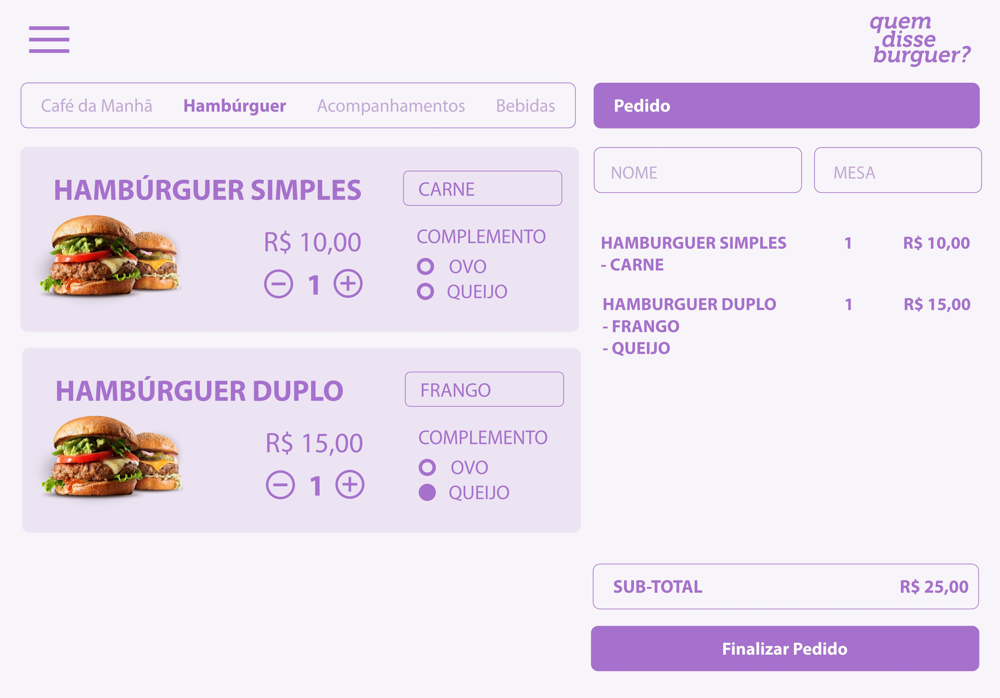
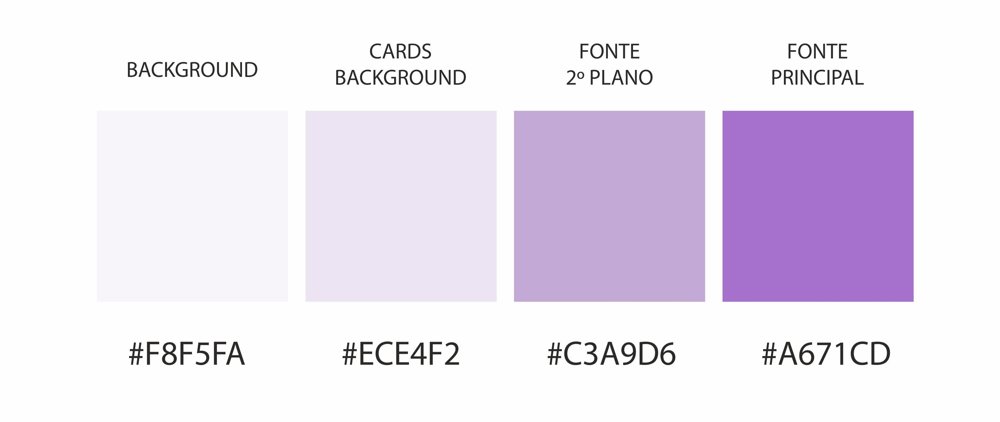

***

***

## SOBRE O PROJETO

Esta é uma aplicação que permite à qualquer funcionário do restaurante **Quem disse Burguer ?** criar uma conta de acesso com suas respectivas credenciais (atendente ou chef de cozinha) e logar-se com ela. Através da mesma, realizar pedidos utilizando um tablet, e enviá-los para a cozinha para que sejam preparados de forma ordenada e eficiente.

### Acesse [Quem disse Burguer ?](https://www.google.com)

## HISTÓRIA DO USUARIO

#### [História de usuário 1] Garçom/Garçonete deve poder entrar no sistema

Eu, como garçom/garçonete quero entrar no sistema de pedidos.

#### [História de usuário 2] Garçom/Garçonete deve ser capaz de anotar o pedido do cliente

Eu como garçom/garçonete quero poder anotar o pedido de um cliente para não
depender da minha memória, saber quanto cobrar e poder enviar os pedidos para a
cozinha para serem preparados em ordem.

#### [História de usuário 3] Chefe de cozinha deve ver os pedidos

Eu como chefe de cozinha quero ver os pedidos dos clientes em ordem, poder
marcar que estão prontos e poder notificar os garçons/garçonetes que o pedido
está pronto para ser entregue ao cliente.

#### [História de usuário 4] Garçom/Garçonete deve ver os pedidos prontos para servir

Eu como garçom/garçonete quero ver os pedidos que estão prontos para entregá-los
rapidamente aos clientes.

## 3 PROTÓTIPOS

## Paleta de cores 

## FLUXOGRAMA

## DEMONSTRAÇÃO DA APLICAÇÃO

## TESTE DE USABILIDADE

### Definição do produto

A cada entrega de história de usuário fizemos testes de usabilidade. A partir desses testes verificamos a necessidade de fazer alterações nas paginas, por exemplo a tela de menu, que foi alterada as cores e tamanho das fontes e ajustes nas mensagens de erro ao cadastrar. Melhoramos também o design da aplicação, padronizando as fontes e cores do feed, proporcionando assim uma experência visual mais agradável para os usuários.

## AUTORAS

### DAYANE RODRIGUES
[@Dayane Linkedin](https://www.linkedin.com/in/dayaneersilva/)

### SUELEN ESCÓRCIO

[@Suelen Linkedin](https://www.linkedin.com/in/suelen-escorcio/)
